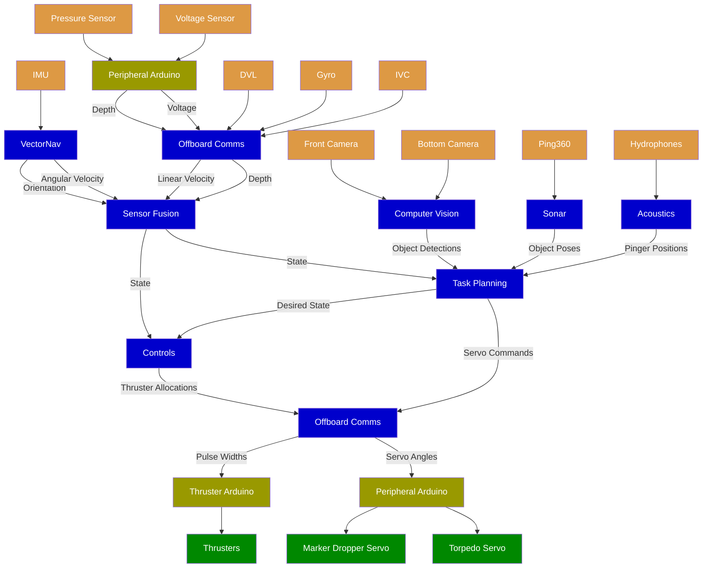
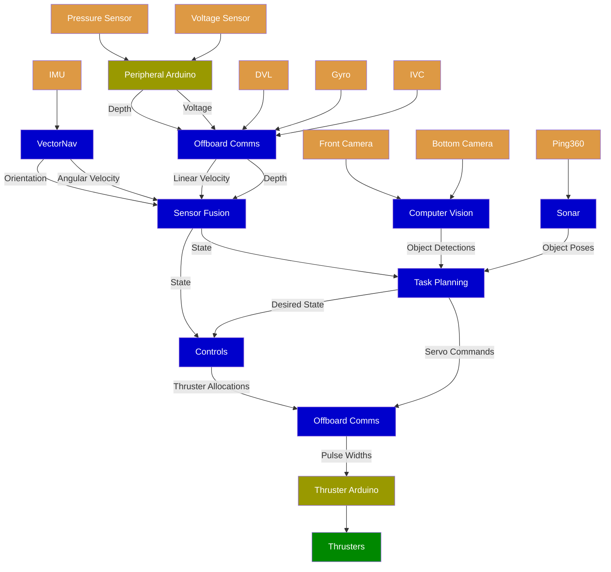

# Duke Robotics Club - RoboSub ROS 2

The Duke Robotics Club is a student organization of [Duke University](https://duke.edu) that develops Autonomous Underwater Vehicles (AUVs) for the [RoboSub](https://robosub.org) competition. Check out [our website](https://duke-robotics.com) for more information about our club and projects.

This repository contains all code required for running and testing our AUVs. The code is built on the [Robot Operating System (ROS) 2](https://github.com/ros2) framework. We use the [Jazzy Jalisco](https://docs.ros.org/en/jazzy) distribution of ROS 2.

Our previous ROS 1 codebase can be found in the [robosub-ros repository](https://github.com/DukeRobotics/robosub-ros).

## System Flow
The high-level diagram below shows the components of the robot's `onboard` software that are used during the robot's autonomous operation and the flow of information between them. The arrows indicate the direction of data flow. The labels on each arrow indicate what data is transmitted. The components are color-coded to indicate their type.
- Sensors who feed data into the software are <span style="color: #000; background-color: #d94">orange</span>.
- Software packages in `onboard` are <span style="color: #ddd; background-color: #00c">blue</span>.
- Hardware whose actions are controlled by the software are <span style="color: #000; background-color: #080">green</span>.
- Hardware that serves as an intermediary between the software and other hardware is <span style="color: #000; background-color: #990">yellow</span>.

### Oogway's System Flow


### Crush's System Flow


## Set Up the Repository and Development Environment
Setting up the repository and development enviornment is an involved process. The full process is documented in the [SETUP.md](SETUP.md) file.

## Build Packages
1. Open a terminal in the Docker container.
2. Navigate to the root of the repository `/home/ubuntu/robosub-ros2`.
3. Run the following command to build all packages:
    ```bash
    source build.sh
    ```
    - This command builds all packages in the `core` and `onboard` workspaces.
4. You are now ready to run the code!

See [SCRIPTS.md](SCRIPTS.md) for more information about how to use `build.sh` and other scripts at the root of the repository.

## Run Code
1. Open a terminal in the Docker container.
2. Make sure you have built all packages by following the instructions in the [Build Packages](#build-packages) section.
2. Run the following command:
    ```bash
    ros2 launch execute robot.launch.py
    ```
    - This command launches all nodes required to run the robot.
    - It does not launch task planning, which must be run separately for the robot to complete tasks autonomously. See the [task planning README](onboard/src/task_planning/README.md) for instructions on launching the task planning node.

## Foxglove
We use [Foxglove Studio](https://foxglove.dev) for visualizing and debugging our code. Foxglove Studio is a web-based tool that allows us to visualize received data and send data in real time to ROS 2 topics and services.

To use Foxglove Studio:
1. Open a terminal in the Docker container.
2. Run the following command to start the Foxglove bridge:
    ```bash
    fg-ws
    ```
    - This is an alias that starts the Foxglove bridge, which enables Foxglove Studio to connect to the ROS 2 network.
    - The bridge opens a WebSocket on port `28765`. This port is mapped to port `28765` on the host machine, so you can connect to the WebSocket from your host machine.
3. Open Foxglove Studio and connect to the WebSocket at `ws://IP_ADDRESS:28765`.
    - Replace `IP_ADDRESS` with the IP address of the host machine. If you are running the Docker container locally, you can use `localhost` as the IP address.

See [foxglove/README.md](foxglove/README.md) for more information about developing for Foxglove.

## Linting
To ensure code quality and consistent formatting, we use the following linters:
- Python: [Ruff](https://docs.astral.sh/ruff)
- C++: [ClangFormat](https://clang.llvm.org/docs/ClangFormat.html)
- Bash: [ShellCheck](https://www.shellcheck.net)
- TypeScript/JavaScript: [ESLint](https://eslint.org)

ESLint can be accessed by the CLI provided by `foxglove.py`; see the [Foxglove README](foxglove/README.md) for more information about running ESLint.

All other linters can be accessed via the CLI provided by `lint.py`. This CLI is also used by the GitHub Actions `build-and-lint` workflow.

To lint all code in the repository with `lint.py`:
1. Open a terminal in the Docker container.
2. Navigate to the root of the repository `/home/ubuntu/robosub-ros2`.
3. Run the following command:
    ```bash
    ./lint.py
    ```
    - This command lints all Python, C++, and Bash code in the repository.
    - Any linting errors or warnings will be displayed in the terminal.
See [`lint.py` in SCRIPTS.md](SCRIPTS.md#lintpy) for more information about the CLI provided by `lint.py`.